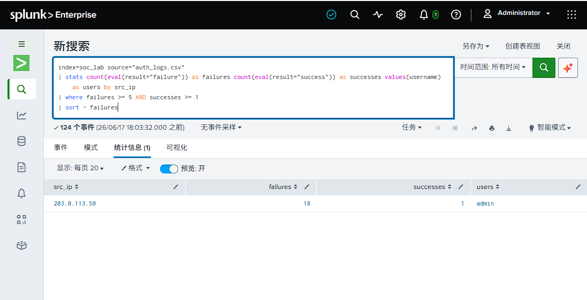
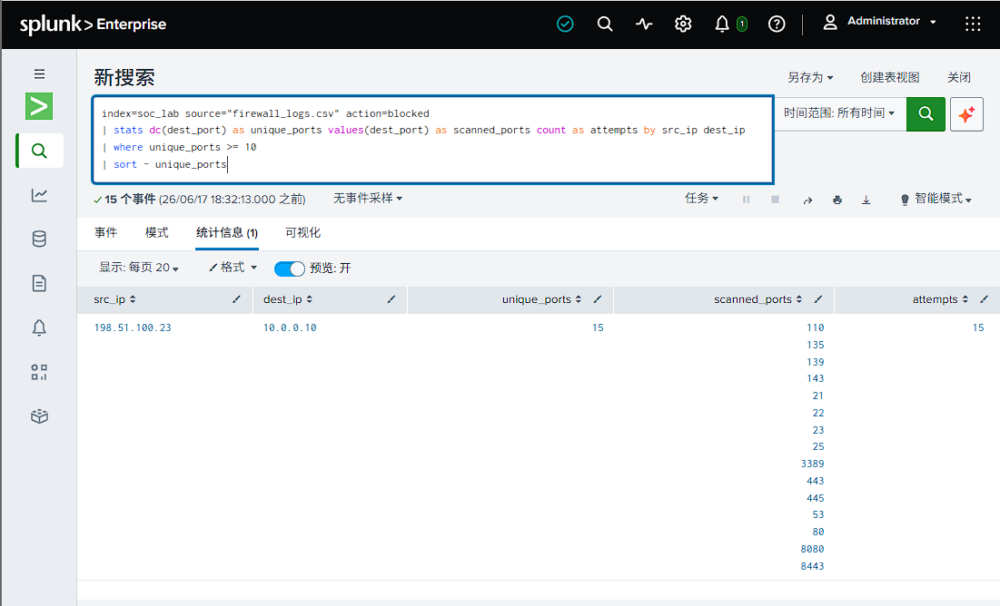
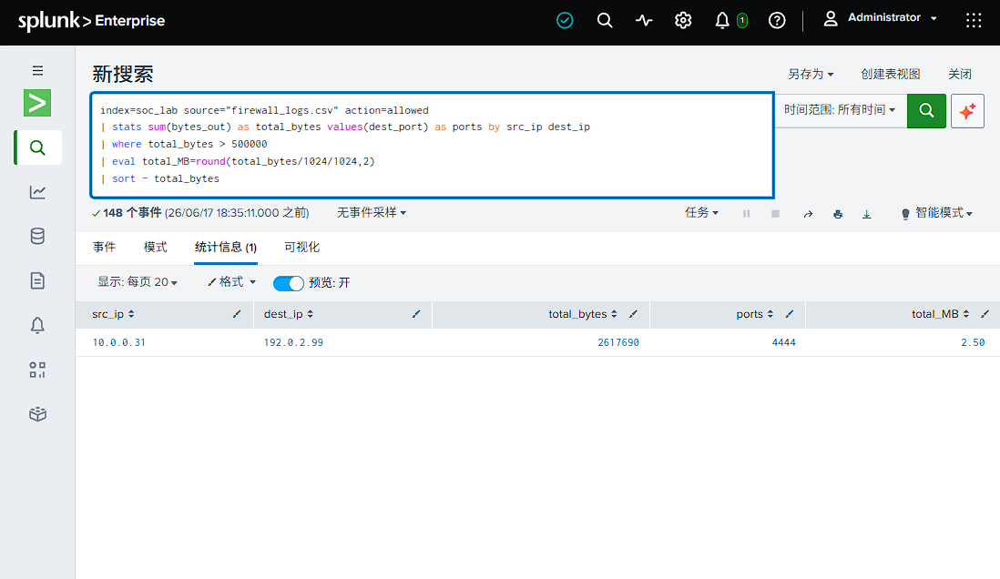
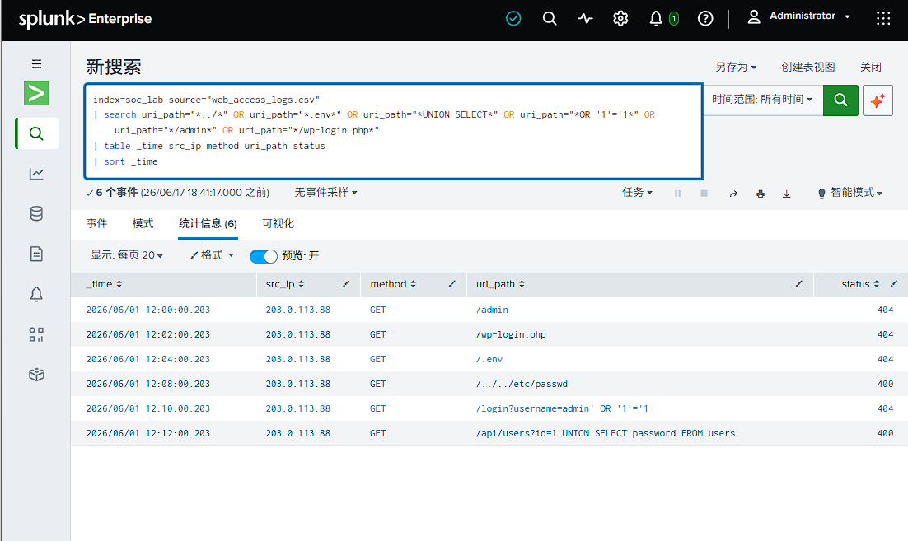
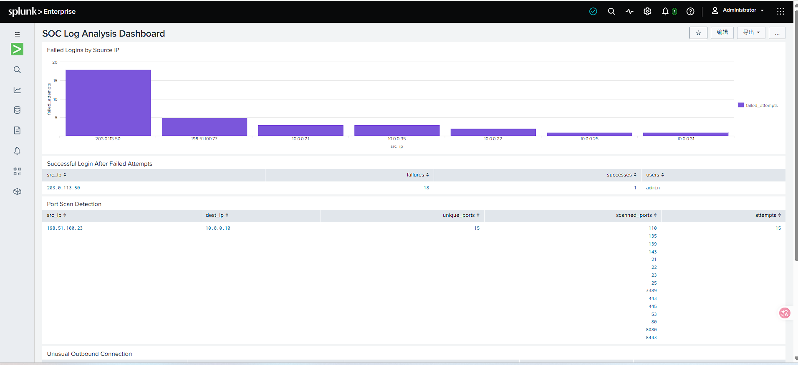
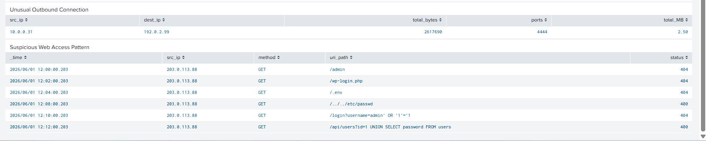

# Detection Use Cases

This document summarises the main detection use cases developed in this Splunk SOC log analysis project.

The project uses three simulated log sources:

* `auth_logs.csv`
* `firewall_logs.csv`
* `web_access_logs.csv`

The detection use cases focus on authentication attacks, network reconnaissance, unusual outbound traffic and suspicious web access patterns.

---

## Detection Use Case 1: Multiple Failed Login Attempts from One IP

### Purpose

This detection identifies source IP addresses that generate multiple failed login attempts. This pattern may indicate a brute-force attack or password guessing activity.

### SPL Query

```spl
index=soc_lab source="auth_logs.csv" result=failure
| stats count as failed_attempts values(username) as targeted_users by src_ip
| sort - failed_attempts
```

### Finding

The source IP address `203.0.113.50` generated 18 failed login attempts against the `admin` account. This is suspicious because the same source repeatedly attempted to authenticate to a privileged account.

### Possible MITRE ATT&CK Mapping

* Brute Force - T1110

### Recommended Response

The security team should review the source IP address, check whether any login attempt later succeeded, and consider blocking the IP address or enforcing multi-factor authentication for privileged accounts.

### Screenshot


---

## Detection Use Case 2: Successful Login After Several Failed Attempts

### Purpose

This detection identifies source IP addresses that have multiple failed login attempts followed by at least one successful login. This pattern may indicate that a brute-force attack successfully compromised an account.

### SPL Query

```spl
index=soc_lab source="auth_logs.csv"
| stats count(eval(result="failure")) as failures count(eval(result="success")) as successes values(username) as users by src_ip
| where failures >= 5 AND successes >= 1
| sort - failures
```

### Finding

The source IP address `203.0.113.50` had 18 failed login attempts and 1 successful login against the `admin` account. This suggests a possible successful brute-force attack.

### Possible MITRE ATT&CK Mapping

* Brute Force - T1110
* Valid Accounts - T1078

### Recommended Response

The security team should reset the `admin` account password, revoke active sessions, review VPN login records, and enable multi-factor authentication for privileged accounts.

### Screenshot



---

## Detection Use Case 3: Port Scan Detection

### Purpose

This detection identifies source IP addresses that attempt to connect to many different destination ports on the same host. This pattern may indicate network reconnaissance or port scanning activity.

### SPL Query

```spl
index=soc_lab source="firewall_logs.csv" action=blocked
| stats dc(dest_port) as unique_ports values(dest_port) as scanned_ports count as attempts by src_ip dest_ip
| where unique_ports >= 10
| sort - unique_ports
```

### Finding

The source IP address `198.51.100.23` attempted to connect to 15 different ports on the internal host `10.0.0.10`. The scanned ports included 21, 22, 23, 25, 53, 80, 443, 445, 3389, 8080 and 8443. This activity suggests possible port scanning or network reconnaissance.

### Possible MITRE ATT&CK Mapping

* Network Service Scanning - T1046

### Recommended Response

The security team should block or monitor the source IP address, review firewall logs for related activity, and check whether any scanned services were exposed or vulnerable.

### Screenshot



---

## Detection Use Case 4: Unusual Outbound Connection

### Purpose

This detection identifies internal hosts that send a large amount of outbound traffic to an external IP address. This pattern may indicate suspicious communication, command-and-control activity, or possible data exfiltration.

### SPL Query

```spl
index=soc_lab source="firewall_logs.csv" action=allowed
| stats sum(bytes_out) as total_bytes values(dest_port) as ports by src_ip dest_ip
| where total_bytes > 500000
| eval total_MB=round(total_bytes/1024/1024,2)
| sort - total_bytes
```

### Finding

The internal host `10.0.0.31` sent 2.50 MB of outbound traffic to the external IP address `192.0.2.99` over destination port `4444`. This connection is suspicious because it involves a high-volume outbound connection to an uncommon port.

### Possible MITRE ATT&CK Mapping

* Exfiltration Over C2 Channel - T1041

### Recommended Response

The security team should investigate the internal host `10.0.0.31`, review endpoint activity, check for suspicious processes, and block or monitor the destination IP address `192.0.2.99`.

### Screenshot



---

## Detection Use Case 5: Suspicious Web Access Pattern

### Purpose

This detection identifies suspicious web requests that may indicate reconnaissance, sensitive file discovery, directory traversal, or SQL injection attempts.

### SPL Query

```spl
index=soc_lab source="web_access_logs.csv"
| search uri_path="*../*" OR uri_path="*.env*" OR uri_path="*UNION SELECT*" OR uri_path="*OR '1'='1*" OR uri_path="*/admin*" OR uri_path="*/wp-login.php*"
| table _time src_ip method uri_path status
| sort _time
```

### Finding

The source IP address `203.0.113.88` sent multiple suspicious web requests, including attempts to access `/admin`, `/wp-login.php`, `/.env`, and `/../../etc/passwd`. It also attempted SQL injection-style requests such as `OR '1'='1` and `UNION SELECT`. This suggests possible web reconnaissance or exploitation attempts.

### Possible MITRE ATT&CK Mapping

* Active Scanning - T1595
* Exploit Public-Facing Application - T1190

### Recommended Response

The security team should review web server logs, block or monitor the source IP address, check whether any request succeeded, and ensure that sensitive files and admin pages are protected.

### Screenshot



---

## Dashboard Screenshots

The Splunk dashboard contains the main detection panels created during the project.





---

## Summary

This project demonstrates a basic SOC investigation workflow using Splunk. The detection logic covers authentication attacks, port scanning, unusual outbound network traffic and suspicious web access attempts. The findings were also mapped to selected MITRE ATT&CK techniques and summarised in a simple incident report.
